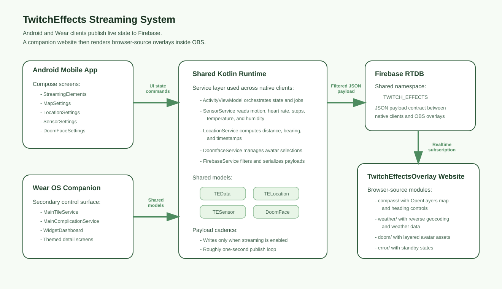

# TwitchEffects - Showcase

> **Note:** This showcase describes the architecture of the TwitchEffects streaming-control system and its companion OBS overlay site. The production implementation spans private Android and web repositories; this document focuses on the design, module boundaries, and integration model.

---

## Overview

**TwitchEffects** is a cross-device overlay control system for livestreaming. An Android phone app and Wear OS companion collect live sensor, location, map, and avatar state, serialize it through Firebase Realtime Database, and drive a companion browser overlay site used as an OBS browser source.

The most interesting part of the system is the contract boundary: native clients and standalone web overlays stay loosely coupled by sharing a single payload model rather than hard-wiring UI code to presentation code.

---

## Architecture



### Layers

| Layer | Responsibility | Key Components |
|-------|---------------|----------------|
| **Presentation** | Android and Wear surfaces for toggles, settings, and live control | Jetpack Compose, Wear Compose, tiles, complication data source |
| **Application** | Orchestration of permissions, streaming state, and share toggles | `ActivityViewModel`, `StateFlow`, coroutine jobs |
| **Shared Runtime** | Hardware data collection and payload construction | `SensorService`, `LocationService`, `DoomfaceService`, `TEData` |
| **Realtime Sync** | Shared transport contract across clients and overlays | Firebase Realtime Database, JSON serialization |
| **OBS Overlay Frontend** | Rendering browser overlays from live payloads | TwitchEffectsOverlay `compass/`, `weather/`, `doom/`, `error/` |

### Data Flow


```
Compose / Wear input
  -> ActivityViewModel state updates
    -> Shared services collect location, sensors, and Doomface data
      -> FirebaseService filters and serializes TEData
        -> Firebase path: TWITCH_EFFECTS
          -> Overlay pages subscribe and parse payload
            -> DOM / map / avatar update inside OBS browser sources
```

---

## Key Modules

### `sharedLibrary/services/` 

**Purpose:** Encapsulates device-side side effects and shared domain logic so both mobile and wearable targets work from one service layer.

**Interface:**

```kotlin
data class TEData(
    val location: TELocation? = null,
    val sensor: TESensor? = null,
    val isDarkModeOn: Boolean? = null,
    val showCompassMap: Boolean? = null,
    val showFullMap: Boolean? = null,
    val compassMapZoom: Int? = null,
    val fullMapZoom: Int? = null,
    val doomface: DoomFace? = null
)

class FirebaseService {
    suspend fun setStoredTEData(teData: TEData): Task<Void>
    suspend fun readStoredTEData(onSuccess: (TwitchEffects?) -> Unit)
}
```

### `twitchEffectsMobile/` 

**Purpose:** Main Android control surface for stream state, map settings, location toggles, sensor toggles, and Doomface configuration.

**Interface:**

```kotlin
class ActivityViewModel(
    private val application: Application,
    private val savedStateHandle: SavedStateHandle
) : ViewModel() {
    val isStreaming: StateFlow<Boolean>
    val currentLocation: StateFlow<TELocation?>
    val currentSensors: StateFlow<TESensor?>

    fun updateIsStreaming(update: Boolean)
    fun setLocationServiceUpdates(context: Context, updatedBoolean: Boolean)
    fun setSensorServiceUpdates(updatedBoolean: Boolean)
    fun updateShowDoomface(show: Boolean)
}
```

### `TwitchEffectsOverlay/` 

**Purpose:** Standalone HTML overlay modules for OBS browser sources, each reacting to the shared Firebase payload.

**Interface:**

```javascript
const firebaseReferenceKey = "TWITCH_EFFECTS";
const firebaseRef = firebase.database().ref(firebaseReferenceKey);

firebaseRef.on("value", function (snapshot) {
  const payload = JSON.parse(snapshot.val());
  renderOverlay(payload);
});

function renderOverlay(payload) {
  // Compass, weather, Doomface, or standby modules
  // update their local DOM based on the shared payload.
}
```

---

## Engineering Decisions

| Decision | Choice | Rationale | Tradeoff |
|----------|--------|-----------|----------|
| Shared runtime logic | Centralize services and models in `sharedLibrary` | Keeps Android and Wear behavior aligned | Tightens coupling to a shared contract |
| Single JSON payload | Publish one serialized value to Firebase | Web overlays can subscribe once and parse locally | Schema changes affect every client |
| Publish-time censorship | Strip disabled fields before upload | Supports privacy and simpler overlay logic | More conditional serialization logic |
| Module-per-overlay frontend | Separate compass/weather/doom/error pages | Isolates CSS and JavaScript concerns for OBS | Shared code is repeated across modules |
| Phone-first orchestration | Use one mobile view model as the main control hub | Simplifies Compose screens and service access | View model breadth must be managed carefully |

---

## Example Code

### Filtered Firebase Publish

```kotlin
suspend fun publishCurrentState(teData: TEData): Task<Void> {
    val filtered = teData.copy(
        location = if (allLocationUpdates.value) teData.location else null,
        sensor = if (allSensorUpdates.value) teData.sensor else null
    )

    val json = Json.encodeToString(filtered)
    return databaseReference.setValue(json)
}
```

**Why this matters:** The integration contract is explicit, and privacy-related rules are enforced before data ever reaches the overlay frontend.

### Streaming Loop Driven by ViewModel State

```kotlin
fun updateIsStreaming(update: Boolean) {
    _isStreaming.value = update

    if (!update) {
        _streamingJob.value?.cancel()
        return
    }

    _streamingJob.value = viewModelScope.launch(Dispatchers.IO) {
        while (isActive) {
            firebaseService.setStoredTEData(buildCurrentPayload())
            delay(1000)
        }
    }
}
```

**Why this matters:** Streaming publication is tied to explicit user intent and runs on a bounded coroutine workflow rather than uncontrolled callbacks.

---

## Project Structure

```
TwitchEffects/
|- twitchEffectsMobile/
|  |- compose/
|  |- MainActivity.kt
|  `- ActivityViewModel.kt
|- sharedLibrary/
|  |- model/
|  `- services/
|- twitcheffectswear/
|  |- tile/
|  `- complication/
`- docs/
   |- portfolio_frontend/
   |- public _repo_frontend/
  `- diagrams/

TwitchEffectsOverlay/
|- compass/
|- weather/
|- doom/
|- error/
`- index.html
```

---

## Tech Stack

| Layer | Technology |
|-------|-----------|
| Language | Kotlin, JavaScript |
| Android UI | Jetpack Compose Material3 |
| Wear UI | Wear Compose, Horologist, Tiles |
| Architecture | ViewModel + StateFlow + shared service layer |
| Realtime Data | Firebase Realtime Database |
| Serialization | kotlinx.serialization |
| Location | Google Play Services Location |
| Sensors | Android SensorManager |
| Maps | OpenLayers |
| Build | Gradle, Android Gradle Plugin 8.1.2 |

---

## Code Availability

This showcase covers the contract design, service boundaries, and OBS overlay architecture. Production repositories include full UI assets, environment-specific configuration, and deployment details that are not part of this public summary.

For the broader system walkthrough including diagrams and cross-repo interaction, see the [portfolio page](../portfolio_frontend/TwitchEffects.html).

An earlier public portfolio page with real screenshots and product framing is also available at [ashourz.com Twitch Effects](https://www.ashourz.com/applications/twitch-effects).

---

## Related

- [Portfolio Page](../portfolio_frontend/TwitchEffects.html) - Full technical case study with architecture and OBS integration diagrams
- TwitchEffectsOverlay - Companion website used as the OBS browser-source rendering layer